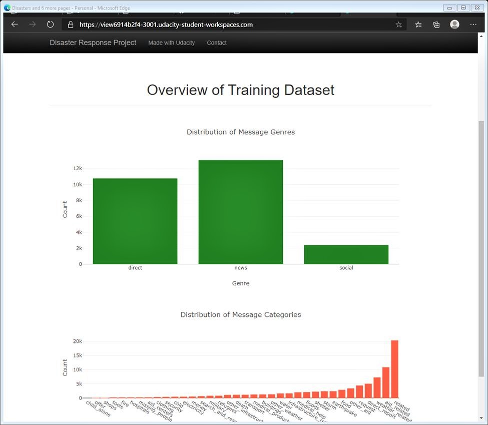

## Disaster_Response_Pipeline Project

## Project portrayal
In this project, we will build a Machine Learning(ML) model with all necessary steps sequenced in a pipeline to classify real messages sent during real natural disasters. These messages can be categorized as medical help, aid related, search and rescue type etc. For this project we have altogether 36 messages categories. The ML pipeline progression will synchronize all programming steps to categorize those messages in such a way that after processing, we can send those specific messages to appropriate disaster relief agencies.

This project will involve these programmatic synchronization:
- basic ETL that loads, categorizes, merges, cleans and Stores data in a SQLite database
- Machine Learning model pipeline builds a text processing system then trains and tunes the model using GridSearchCV hyper-parametarization
- Flask Web App visualizes classified messages result.

This is a multi-label classification task, since a message can belong to one or more categories. We will be working with a data set provided by [Figure Eight](https://www.figure-eight.com/) containing real messages that were sent during disaster events.

## Our task
In this project we'll be applying our  natural language processing,  machine learning and data engineering skills as a data scientist.This project will show off our software skills, including our ability to create basic data pipelines and write clean, organized code!

Our project will include a Flask web app where an emergency worker can input a new message and get classification results in several categories. The web app will also display visualizations of the data. 

Here is a single screenshot comes out as a product of our web-app.

## File Description
~~~~~~~
        disaster_response_pipeline
          | app |
          |- templates | folder 1 |
                                  |- go.html
                                  |- master.html
                                  |- run.py
                           | data | folder 2 |
                                   - disaster_message.csv
                                   - disaster_categories.csv
                                   - DisasterResponse.db
                                                             | ETL | folder 3 |
                                                                   - ETL Pipeline Preparation.ipynb
                                                                   - process_data.py
                                                                                      | ML models | folder 4 |
                                                                                                  - ML Pipeline Preparation.ipynb
                                                                                                  - train_classifier.py
~~~~~~~

### Description of key files
~~~~~~~~
1. disaster_message.csv: Includes the original disaster messages
2. disaster_categories.csv: Includes the target-labels of the disaster messages
3. process_data.py: Runs the ETL pipeline to process data from both disaster_message.csv and disaster_categories.csv files and load them into an SQLite database named DisasterResponse.db.
4. DisasterResponse.db: The SQLite database contains file named 'messages' with disaster related messages and their categories
5. train_classifier.py: Runs the ML pipeline to classify the messages and optimize model using grid search cv and print the model's evaluation. It will then save the ML processes to a classifier.pk file.
6. run.py: Script to run the web app for the users
~~~~~~~~~
## Instructions
1. Run the following commands in the project's root directory to set up your database and model.

    - To run ETL pipeline that cleans data and stores in database
        `python data/process_data.py data/disaster_messages.csv data/disaster_categories.csv data/DisasterResponse.db`
        
    - To run ML pipeline that trains classifier (RandomForest with Tfidf Vectorizer) and saves to a pickle file
        `python models/train_classifier.py data/DisasterResponse.db models/classifier.pkl`

2. In the app directory, run the following command to run the web app.
    `python run.py`

3. Go to http://localhost:3001 to view the web app

## Installations
punkt, wordne, stopwords, Nltk, re, SQLAlchemy

## Licensing, Authors, Acknowledgements
Udacity must get the credit as the true provider of starter programming codes along with data set provided by [Figure Eight](https://www.figure-eight.com/) containing real messages that were sent during disaster events.

### Student: Md Ahmed
